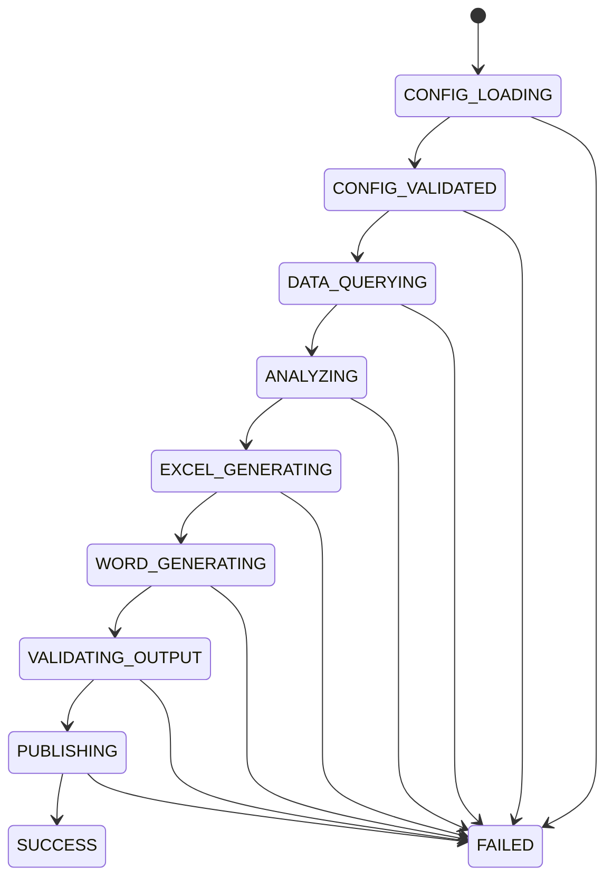
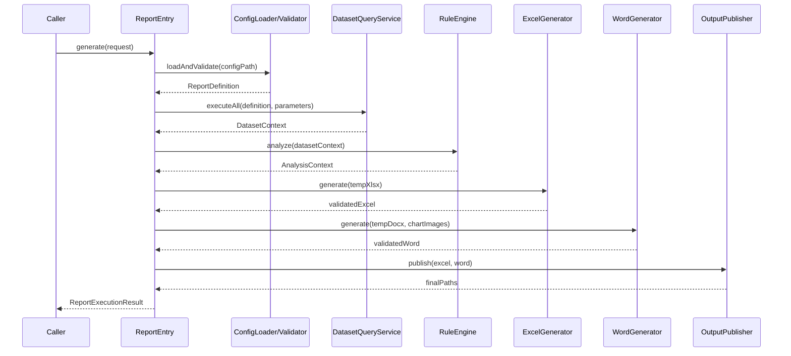

# 效能报表自动生成组件详细设计说明书

文档版本：V1.0  
文档状态：设计确认稿  
编制日期：2026-07-27  
对应需求：[效能报表自动生成组件需求规格说明书](./superpowers/specs/2026-07-27-efficiency-report-generator-design.md)

## 1. 文档目的

本文档将已确认的需求转换为可实施的技术设计，规定工程结构、模块职责、核心接口、配置模型、运行流程、SQL 执行、规则引擎、Excel/Word 模板处理、图表生成、错误策略、日志、安全和测试方案。

本文档不增加 REST API、定时任务、Web 管理页面等未纳入首版范围的功能。

## 2. 已确认约束

| 类别 | 约束 |
|---|---|
| Java | Java 1.8 |
| 应用框架 | Spring Boot 2.7.x，基线采用 2.7.18 |
| 数据库 | MySQL 5.7 |
| 调用方式 | 直接调用统一 Java 入口类 |
| 配置方式 | YAML/JSON 主配置 + 独立 SQL 文件 |
| 模板 | Excel 模板 + Word 模板 |
| SQL 数量 | 单份报表支持至少 50 条具名 SQL |
| 数据模型 | 不绑定固定业务实体，使用通用数据集 |
| 规则 | 支持任意层级 `AND/OR` 组合 |
| 输出顺序 | 先 Excel，后 Word |
| Excel 数据页 | 每条 SQL 对应一个独立、可见的 Sheet |
| 图表关联 | 通过 Excel“图表设计 → 选择数据”查看，不生成关系页 |
| 图表 | 支持常用图表、堆积图、组合图和模板原生图表 |
| Word 图表 | 使用相同数据和图表模型生成高清图片 |
| Word 结构 | 模板控制版式，配置驱动动态章节树和组件顺序 |
| Word 目录 | 基于真实标题样式的目录域，打开文档时自动更新 |
| 分析文字 | 固定模板 + 规则生成，不调用大模型 |
| 水印 | 不生成水印 |
| 失败处理 | 不在正式输出目录留下半成品 |

## 3. 技术选型

### 3.1 主要技术

| 能力 | 选型 | 设计理由 |
|---|---|---|
| 依赖管理 | Maven | 与 Spring Boot 2.7 配套成熟，便于锁定 Java 8 依赖 |
| 配置解析 | Jackson YAML + Jackson JSON | YAML/JSON 统一映射为同一组配置类 |
| 配置校验 | Hibernate Validator / 自定义交叉校验 | 处理字段级约束、引用完整性和依赖环 |
| 数据访问 | Spring JDBC `NamedParameterJdbcTemplate` | 支持命名参数、集合参数和通用行映射 |
| 连接池 | Spring Boot 默认 HikariCP | 支持超时、只读连接和连接泄漏检测 |
| Excel/Word | Apache POI 5.x 的 Java 8 兼容版本线 | 同时提供 XSSF、XWPF 和底层 OOXML 能力 |
| 图表图片 | JFreeChart 1.5.x + 自定义渲染器 SPI | 覆盖类别、XY、饼图、雷达、股票和组合图 |
| 日志 | SLF4J + Logback | Spring Boot 默认日志体系 |
| 测试 | JUnit 5、Mockito、Testcontainers | 单元测试、MySQL 5.7 集成测试和文件结构测试 |

### 3.2 版本策略

- Spring Boot 固定为 `2.7.18`，该版本支持 Java 8。
- Apache POI 使用仍支持 Java 8 的 5.x 版本，并在 Maven 中锁定版本，不使用浮动版本。
- 第三方依赖必须通过 Maven Enforcer 和依赖收敛检查。
- 发布前执行依赖漏洞扫描；出现只在高版本修复、但高版本不再支持 Java 8 的问题时，必须评估升级 Java，而不是忽略漏洞。

## 4. 总体架构


架构采用“分阶段流水线 + 每次执行独立上下文”：

1. 配置阶段不访问数据库。
2. 查询阶段在只读事务内完成所有 SQL，得到不可变数据上下文。
3. 分析阶段执行转换、异常规则和文字生成。
4. 文档阶段先生成 Excel，再生成 Word。
5. 发布阶段一次性将两个文件移入正式输出目录。

任何阶段失败都停止后续阶段并清理本次临时目录。

## 5. 工程与包结构

项目采用单 Maven 模块起步。接口与实现按业务能力拆分，避免按 Controller/Service/Util 形成无边界的大包。

```text
xnreport/
├─ pom.xml
├─ src/main/java/com/xn/report/
│  ├─ XnReportApplication.java
│  ├─ entry/
│  │  ├─ ReportEntry.java
│  │  ├─ DefaultReportEntry.java
│  │  ├─ ReportExecutionRequest.java
│  │  ├─ ReportExecutionResult.java
│  │  ├─ ExecutionStatus.java
│  │  └─ ReportWarning.java
│  ├─ config/
│  │  ├─ ReportDefinition.java
│  │  ├─ ReportDefinitionLoader.java
│  │  ├─ ReportDefinitionValidator.java
│  │  ├─ ValidationIssue.java
│  │  └─ definition/
│  │     ├─ DatasetDefinition.java
│  │     ├─ RuleDefinition.java
│  │     ├─ ChartDefinition.java
│  │     ├─ ExcelDefinition.java
│  │     ├─ WordDefinition.java
│  │     ├─ WordCoverDefinition.java
│  │     ├─ WordTocDefinition.java
│  │     ├─ WordSectionDefinition.java
│  │     ├─ WordComponentDefinition.java
│  │     ├─ NarrativeDefinition.java
│  │     ├─ DistributionDefinition.java
│  │     └─ PolicyDefinition.java
│  ├─ execution/
│  │  ├─ ExecutionContext.java
│  │  ├─ ExecutionStage.java
│  │  ├─ ReportPipeline.java
│  │  └─ ExecutionMetrics.java
│  ├─ analysis/
│  │  ├─ AnalysisService.java
│  │  └─ AnalysisContext.java
│  ├─ dataset/
│  │  ├─ DatasetPlanner.java
│  │  ├─ DatasetQueryService.java
│  │  ├─ DatasetContext.java
│  │  ├─ DatasetResult.java
│  │  ├─ DatasetRow.java
│  │  ├─ DatasetSchema.java
│  │  └─ DatasetType.java
│  ├─ sql/
│  │  ├─ SqlFileRepository.java
│  │  ├─ ReadOnlySqlGuard.java
│  │  ├─ SqlParameterResolver.java
│  │  ├─ NamedSqlExecutor.java
│  │  └─ ResultSetRowMapper.java
│  ├─ transform/
│  │  ├─ Transform.java
│  │  ├─ TransformEngine.java
│  │  ├─ FilterTransform.java
│  │  ├─ SortTransform.java
│  │  ├─ DistinctTransform.java
│  │  ├─ LimitTransform.java
│  │  └─ DerivedFieldTransform.java
│  ├─ rule/
│  │  ├─ RuleEngine.java
│  │  ├─ ConditionNode.java
│  │  ├─ LogicalCondition.java
│  │  ├─ ComparisonCondition.java
│  │  ├─ ValueReference.java
│  │  ├─ RuleEvaluationContext.java
│  │  ├─ RuleResult.java
│  │  └─ RuleGroupResult.java
│  ├─ text/
│  │  ├─ TextRenderer.java
│  │  ├─ PlaceholderParser.java
│  │  ├─ ValueFormatter.java
│  │  ├─ FormatterRegistry.java
│  │  ├─ NarrativeEngine.java
│  │  ├─ TrendAnalyzer.java
│  │  └─ DistributionAnalyzer.java
│  ├─ chart/
│  │  ├─ ChartEngine.java
│  │  ├─ ChartModel.java
│  │  ├─ ChartSeriesModel.java
│  │  ├─ ChartCategoryAxis.java
│  │  ├─ LegendPosition.java
│  │  ├─ ChartModelBuilder.java
│  │  ├─ ExcelNativeChartWriter.java
│  │  ├─ TemplateChartBinder.java
│  │  ├─ ChartImageRenderer.java
│  │  ├─ ChartRenderOptions.java
│  │  ├─ RenderedChart.java
│  │  └─ JFreeChartImageRenderer.java
│  ├─ excel/
│  │  ├─ ExcelGenerator.java
│  │  ├─ ExcelTemplateLoader.java
│  │  ├─ ExcelValueBinder.java
│  │  ├─ ExcelTableWriter.java
│  │  └─ ExcelOutputValidator.java
│  ├─ word/
│  │  ├─ WordGenerator.java
│  │  ├─ WordTemplateLoader.java
│  │  ├─ WordRunTextReplacer.java
│  │  ├─ WordCoverBinder.java
│  │  ├─ WordSectionRenderer.java
│  │  ├─ WordComponentRenderer.java
│  │  ├─ WordTocManager.java
│  │  ├─ WordNumberingManager.java
│  │  ├─ WordTableWriter.java
│  │  ├─ WordImageWriter.java
│  │  ├─ WordAttachmentWriter.java
│  │  ├─ WordWatermarkValidator.java
│  │  └─ WordOutputValidator.java
│  ├─ output/
│  │  ├─ ExecutionWorkspace.java
│  │  ├─ OutputPublisher.java
│  │  ├─ OutputNameRenderer.java
│  │  └─ CollisionPolicy.java
│  ├─ policy/
│  │  ├─ EmptyDataPolicy.java
│  │  ├─ MissingFieldPolicy.java
│  │  ├─ TypeMismatchPolicy.java
│  │  └─ NullValuePolicy.java
│  └─ error/
│     ├─ ReportException.java
│     ├─ ReportErrorCode.java
│     └─ ReportErrorDetail.java
├─ src/main/resources/
│  ├─ application.yml
│  └─ schema/
│     └─ report-definition.schema.json
└─ src/test/
   ├─ java/com/xn/report/...
   └─ resources/fixtures/
      ├─ configs/
      ├─ sql/
      └─ templates/
```

## 6. 核心接口

### 6.1 统一入口

```java
public interface ReportEntry {

    ReportExecutionResult generate(ReportExecutionRequest request);
}
```

```java
public final class ReportExecutionRequest {

    private final Path reportConfigPath;
    private final Map<String, Object> runtimeParameters;

    public ReportExecutionRequest(
            Path reportConfigPath,
            Map<String, Object> runtimeParameters) {
        this.reportConfigPath = reportConfigPath;
        this.runtimeParameters = Collections.unmodifiableMap(
                new LinkedHashMap<String, Object>(runtimeParameters));
    }

    public Path getReportConfigPath() {
        return reportConfigPath;
    }

    public Map<String, Object> getRuntimeParameters() {
        return runtimeParameters;
    }
}
```

入口只接收主配置路径和运行参数。SQL、模板、输出目录均从主配置和应用配置解析，避免调用方掌握内部文件布局。

### 6.2 执行结果

```java
public final class ReportExecutionResult {

    private String executionId;
    private String reportCode;
    private ExecutionStatus status;
    private Instant startedAt;
    private Instant finishedAt;
    private Path excelPath;
    private Path wordPath;
    private Map<String, Long> datasetRowCounts;
    private List<ReportWarning> warnings;
    private ReportErrorDetail error;
}
```

`ExecutionStatus` 取值：

- `SUCCESS`：两个文件均生成并发布成功。
- `SUCCESS_WITH_WARNINGS`：两个文件成功，但存在按策略跳过的数据或组件。
- `FAILED`：未发布任何正式文件。

首版不存在“只发布 Excel”的部分成功状态。

### 6.3 流水线

```java
public interface ReportPipeline {

    ReportExecutionResult execute(ReportExecutionRequest request);
}
```

`DefaultReportEntry` 只负责参数入口和调用 `ReportPipeline`，不承担 SQL、规则或模板逻辑。

## 7. 执行上下文

### 7.1 ExecutionContext

每次调用创建独立上下文，不使用全局可变状态：

```java
public final class ExecutionContext {

    private final String executionId;
    private final ReportDefinition definition;
    private final Map<String, Object> runtimeParameters;
    private final Path temporaryDirectory;
    private DatasetContext datasetContext;
    private AnalysisContext analysisContext;
    private ExecutionStage stage;
    private final ExecutionMetrics metrics;
    private final List<ReportWarning> warnings;
}
```

线程安全原则：

- Spring 单例组件必须无状态。
- Workbook、Document、ChartModel 和临时路径均放在方法局部或执行上下文中。
- 同一模板文件可被多个执行同时读取，但每次执行必须复制为独立工作文件。
- 正式输出文件发布前使用目标路径锁，避免同名并发覆盖。

`AnalysisContext` 是查询结果与文档生成之间的不可变分析结果：

```java
public final class AnalysisContext {

    private final DatasetContext datasetContext;
    private final Map<String, RuleResult> ruleResults;
    private final Map<String, String> renderedTexts;

    public DatasetContext getDatasetContext() {
        return datasetContext;
    }

    public RuleResult getRuleResult(String ruleId) {
        return ruleResults.get(ruleId);
    }

    public String getRenderedText(String textId) {
        return renderedTexts.get(textId);
    }
}
```

### 7.2 阶段状态



日志和错误必须携带失败时的 `ExecutionStage`。

## 8. 配置文件详细设计

### 8.1 根结构

```yaml
schemaVersion: "1.0"

report:
  code: api-design-efficiency
  name: API设计效能报告
  excelTemplate: api-design-efficiency.xlsx
  wordTemplate: api-design-efficiency.docx
  excelFileName: "API设计效能报告_${period}.xlsx"
  wordFileName: "API设计效能报告_${period}.docx"
  collisionPolicy: VERSIONED

parameters:
  startTime:
    type: DATETIME
    required: true
  endTimeExclusive:
    type: DATETIME
    required: true
  baselineStartTime:
    type: DATETIME
    required: true
  baselineEndTimeExclusive:
    type: DATETIME
    required: true
  centerNames:
    type: STRING_LIST
    required: true
    minItems: 1
  period:
    type: STRING
    required: true

datasets: []
rules: []
charts: []
excel: {}
word:
  cover:
    title: 研发效能报告
    organization: 软件开发二中心
    reportPeriod: 2026年6月
    preparedBy: 效能小组
    preparedDate: 2026年7月23日
  toc:
    enabled: true
    maxLevel: 3
    updateOnOpen: true
  sections:
    - id: deliverySpeed
      title: 交付速率
      level: 1
      emptyStrategy: KEEP
      children:
        - id: apiApprovalDuration
          title: 设计平台审批时长
          level: 2
          components:
            - type: SCENARIO
              text: 反映审核人员在周期内审批节点的时长。
            - type: KEY_FACTORS
              text: API设计平台审批时长、数据库表设计平台审批时长。
            - type: CHART
              chartId: apiApprovalTrend
            - type: RULE_TEXT
              narrativeId: apiApprovalAnnualSummary
            - type: UNIT
              text: 小时
            - type: ATTACHMENT
              text: 附件信息
policies: {}
```

### 8.2 解析规则

- YAML 和 JSON 映射到同一 `ReportDefinition`。
- `schemaVersion` 必须存在；不支持的版本在访问数据库前失败。
- 未声明字段默认判定为错误，防止拼写错误被静默忽略。
- `sqlFile` 与内联 `sql` 必须且只能配置一个；生产报表优先使用 `sqlFile`。
- 相对路径以主配置文件所在目录为起点解析。
- 路径规范化后必须位于允许的配置、SQL、模板或输出根目录内。
- 数据库密码不得出现在报表配置中。

`report-definition.schema.json` 为编辑器提供字段提示和基础结构校验；运行时仍以 Java 配置类校验和交叉引用校验为最终依据。JSON Schema 与 YAML/JSON 示例必须纳入测试，避免文档、Schema 和 Java 类型漂移。

### 8.3 数据集定义

```yaml
datasets:
  - id: centerMonthly
    sheetName: 中心-每月
    description: 中心每月审批耗时
    sqlFile: sql/center-monthly.sql
    # sql: "SELECT ..."  # 短查询可使用；与 sqlFile 二选一
    resultType: LIST
    dependsOn: []
    parameters:
      startTime:
        from: RUNTIME
        key: startTime
      endTimeExclusive:
        from: RUNTIME
        key: endTimeExclusive
      centerNames:
        from: RUNTIME
        key: centerNames
      baselineStartTime:
        from: RUNTIME
        key: baselineStartTime
      baselineEndTimeExclusive:
        from: RUNTIME
        key: baselineEndTimeExclusive
    expectedFields:
      nodeName:
        type: STRING
        required: true
      centerName:
        type: STRING
        required: true
      statMonth:
        type: STRING
        required: true
      avgHours:
        type: DECIMAL
        required: false
      baselineHours:
        type: DECIMAL
        required: false
    limits:
      timeoutSeconds: 60
      maxRows: 10000
```

参数来源：

- `RUNTIME`：入口运行参数。
- `CONSTANT`：配置常量。
- `DATASET`：已执行标量或单行数据集字段。

列表数据集不能作为单个 SQL 参数隐式展开。需要展开时必须将来源字段声明为集合并受 `maxItems` 限制。

### 8.4 图表定义

图表有三种 Excel 模式：

- `GENERATED_NATIVE`：程序创建 Excel 原生图表。
- `TEMPLATE_NATIVE`：模板中预先存在图表，程序只更新数据范围和缓存。
- `IMAGE`：将图片插入 Excel；仅用于原生模式无法满足且用户接受不可编辑图表的场景。

```yaml
charts:
  - id: centerEventChart
    title: 中心事件数
    dataset: centerMonthly
    excelMode: TEMPLATE_NATIVE
    templateChartMarker: "REPORT_CHART:centerEventChart"
    sourceSheet: 中心-每月
    sourceTable: tbl_center_monthly
    categoryField: statMonth
    groupByField: nodeName
    widthCm: 16.0
    heightCm: 8.5
    imageDpi: 180
    series:
      - field: uncertainCount
        name: 不定责事件
        type: STACKED_COLUMN
        stackGroup: event
        axis: PRIMARY
        color: "#5B9BD5"
      - field: certainCount
        name: 定责事件
        type: STACKED_COLUMN
        stackGroup: event
        axis: PRIMARY
        color: "#ED7D31"
      - field: baseline
        name: 中心基准值
        type: LINE
        axis: PRIMARY
        color: "#7F7F7F"
        marker: true
        dataLabel: false
```

### 8.5 策略定义

```yaml
policies:
  emptyData: OUTPUT_MESSAGE
  emptyMessage: 本期无数据
  missingField: FAIL
  typeMismatch: FAIL
  nullValue: RULE_NOT_MATCHED
  emptyCollectionParameter: FAIL
  unresolvedPlaceholder: FAIL
```

覆盖顺序：

```text
组件策略 > 规则策略 > 数据集策略 > 报表全局策略 > 系统默认策略
```

### 8.6 Word 章节和文字定义

`WordSectionDefinition` 使用递归 `children` 表示章节树；`level` 允许 1—4，父章节与子章节级别必须严格递增。章节标识在报表内唯一，组件按配置数组顺序渲染。

组件类型包括：

- `SCENARIO`：场景说明。
- `KEY_FACTORS`：构成要素。
- `FIXED_TEXT`：固定模板文字。
- `RULE_TEXT`：规则或分析器生成文字。
- `CHART`：图表图片。
- `TABLE`：动态表格。
- `UNIT`：单位说明。
- `ATTACHMENT`：附件标题或附件信息。

章节空数据策略：

- `KEEP`：保留章节和已有静态组件。
- `SHOW_EMPTY`：保留章节并输出配置的空态文字。
- `SKIP`：整个章节不生成，也不进入目录。

`NarrativeDefinition.sourceType` 只允许 `FIXED_TEMPLATE` 或 `RULE_GENERATED`。规则生成类型还需声明分析器、输入数据集、比较基准、格式和句式，所有输出都能追溯到确定的数据及规则。

## 9. 配置校验设计

校验分三层执行。

### 9.1 结构校验

- 必填字段。
- 枚举取值。
- 数值范围。
- 标识格式。
- 参数类型。
- 文件扩展名。
- 数据集必须且只能声明 `sqlFile` 或 `sql` 中的一种。

### 9.2 引用校验

- 数据集、规则、图表和绑定标识唯一。
- `dependsOn` 引用存在。
- 数据集参数来源存在。
- 图表字段存在于 `expectedFields`。
- 规则字段和 `valueFrom` 来源存在。
- Excel 表名、Word 绑定名不存在重复声明。

### 9.3 语义校验

- 数据集依赖无环。
- `SINGLE` 数据集没有配置列表专用转换。
- 堆积系列的类别轴和堆积组一致。
- 散点图包含 X、Y 字段；气泡图包含 X、Y、Size 字段。
- 股票图包含时间、开盘、最高、最低、收盘字段。
- 输出文件名解析后不跨出输出根目录。
- `endTimeExclusive` 必须晚于 `startTime`。
- 集合参数为空时按策略处理，不将空列表交给 JDBC。

校验结果使用 `List<ValidationIssue>` 汇总返回，一次显示全部可发现问题，避免调用方逐个修复。

## 10. 数据集规划与 SQL 执行

### 10.1 依赖规划

`DatasetPlanner` 使用 Kahn 拓扑排序：

1. 为每个数据集计算入度。
2. 将入度为 0 的数据集按配置顺序入队。
3. 依次输出并降低下游入度。
4. 输出数量小于数据集总数时，报告形成环的标识链。

首版即使同层数据集互不依赖，也按配置顺序串行执行，保证日志顺序稳定并控制数据库压力。

### 10.2 只读事务

全部查询在一个只读事务中完成：

```java
@Transactional(
    readOnly = true,
    isolation = Isolation.REPEATABLE_READ,
    rollbackFor = Exception.class
)
public DatasetContext executeAll(
        ReportDefinition definition,
        Map<String, Object> runtimeParameters) {
    // 按规划顺序执行并构建不可变 DatasetContext
}
```

查询阶段完成后事务结束，再生成 Excel 和 Word，避免长时间占用数据库连接。

`REPEATABLE_READ` 用于保证几十条 SQL 看到同一事务快照。若现场数据库有明确的一致性策略，可通过应用级配置改为 `READ_COMMITTED`，但不能由单份报表随意覆盖。

### 10.3 SQL 文件读取

`SqlFileRepository`：

- 按 UTF-8 读取。
- 去除 UTF-8 BOM。
- 保留 SQL 内部换行用于错误定位。
- 缓存只读 SQL 文本，缓存键包含规范化路径和最后修改时间。
- 不缓存查询结果。

内联 SQL 不经过文件读取，但必须经过相同的只读防护、参数解析和查询限制。内联 SQL 只适合短小查询，复杂聚合应使用独立 SQL 文件。

### 10.4 只读防护

`ReadOnlySqlGuard` 采用多重防护：

1. 数据库账号只授予 `SELECT` 权限。
2. JDBC URL 强制 `allowMultiQueries=false`。
3. 连接和事务标记为只读。
4. SQL 去除注释后必须以 `SELECT` 开头。
5. 拒绝字符串字面量之外的多语句分号。
6. 拒绝 `INSERT`、`UPDATE`、`DELETE`、`REPLACE`、`MERGE`、`CALL`、`CREATE`、`ALTER`、`DROP`、`TRUNCATE`。

MySQL 5.7 不支持通用 CTE，因此首版不接受以 `WITH` 开头的查询。

### 10.5 参数解析

`SqlParameterResolver` 将数据集参数解析为 `MapSqlParameterSource`。

关键规则：

- 日期时间统一转换为 `java.sql.Timestamp`。
- 小数统一使用 `BigDecimal`。
- 集合参数复制为不可变列表。
- 缺少必填参数立即失败。
- 空集合默认失败，避免生成非法 `IN ()`。
- 参数日志只记录名称、类型和集合长度；敏感参数值不记录。

### 10.6 行映射

`ResultSetRowMapper` 使用 `ResultSetMetaData.getColumnLabel()` 获取 SQL 别名，写入保持列顺序的 `LinkedHashMap<String, Object>`。

标准化规则：

| JDBC 类型 | 内部类型 |
|---|---|
| 整数类型 | `Long` |
| DECIMAL / NUMERIC | `BigDecimal` |
| FLOAT / DOUBLE | `BigDecimal`，通过字符串构造避免二进制误差扩散 |
| DATE | `LocalDate` |
| TIMESTAMP / DATETIME | `LocalDateTime` |
| BIT / BOOLEAN | `Boolean` |
| CHAR / VARCHAR / TEXT | `String` |
| NULL | `null` |

字段解析默认大小写不敏感，但 `DatasetRow` 保留 SQL 声明的原始别名用于输出和日志。

### 10.7 数据集结果

```java
public final class DatasetResult {

    private final String datasetId;
    private final DatasetType type;
    private final DatasetSchema schema;
    private final List<DatasetRow> rows;

    public Object scalar();

    public DatasetRow single();

    public List<DatasetRow> list();
}
```

行为约束：

- `SCALAR` 查询返回 0 行时按空数据策略处理，返回多行或多列时失败。
- `SINGLE` 返回多行时失败，不自动取第一行。
- `LIST` 可以返回 0 行。
- 查询超过 `maxRows` 时失败，不静默截断。
- 所有结果在查询阶段结束后转为不可变对象。

## 11. 数据转换设计

转换按配置顺序执行，每个转换产生新的逻辑视图，不修改原始 `DatasetResult`。

### 11.1 支持的转换

- `FILTER`：复用规则条件模型筛选记录。
- `SORT`：多字段稳定排序。
- `DISTINCT`：按指定字段去重。
- `LIMIT`：取前 N 条。
- `DERIVED_FIELD`：支持加、减、乘、除、比例和状态映射。
- `GROUP_SUMMARY`：计算计数、求和、平均、最大和最小。

### 11.2 表达式边界

首版不使用 SpEL、Groovy、JavaScript 或任意脚本，避免执行任意代码。派生字段只允许白名单操作符和显式字段引用。

除法规则：

- 除数为 0 时按转换策略失败、置空或使用默认值。
- 小数使用 `BigDecimal`。
- 舍入模式和小数位必须显式配置，默认 `HALF_UP`、2 位。

## 12. 异常规则引擎

### 12.1 条件组合

```java
public interface ConditionNode {

    boolean evaluate(RuleEvaluationContext context, DatasetRow row);
}
```

```java
public final class LogicalCondition implements ConditionNode {

    private LogicalOperator operator;
    private List<ConditionNode> children;
}
```

```java
public final class ComparisonCondition implements ConditionNode {

    private ValueReference left;
    private ComparisonOperator operator;
    private ValueReference right;
}
```

`LogicalCondition`：

- `AND` 使用短路求值，任一子条件为 `false` 即停止。
- `OR` 使用短路求值，任一子条件为 `true` 即停止。
- 空子节点列表为配置错误，不定义隐式真假值。

### 12.2 值引用

```yaml
left:
  source: CURRENT_FIELD
  field: avgHours
operator: GT
right:
  source: DATASET_FIELD
  dataset: baselineSummary
  field: standardHours
```

`ValueReference.source`：

- `LITERAL`
- `RUNTIME_PARAMETER`
- `CURRENT_FIELD`
- `DATASET_FIELD`

`DATASET_FIELD` 只允许引用 `SCALAR` 或 `SINGLE` 数据集。引用 `LIST` 时必须先通过 `GROUP_SUMMARY` 生成单值。

### 12.3 类型比较

- 数值统一转为 `BigDecimal` 后比较。
- 日期只允许同类时间语义比较，不将普通字符串按字典序当作日期。
- 字符串比较默认区分大小写，可在条件上设置 `ignoreCase`。
- `IN` 右侧必须为集合。
- `BETWEEN` 包含边界。
- `null` 仅能由 `IS_NULL`、`IS_NOT_NULL` 直接匹配；普通比较按 `nullValue` 策略处理。

### 12.4 规则输出

```java
public final class RuleResult {

    private final String ruleId;
    private final List<DatasetRow> matchedRows;
    private final Map<String, RuleGroupResult> groups;
    private final String renderedText;
    private final Map<String, Object> summaryValues;
}
```

处理顺序：

1. 遍历数据集并评估条件。
2. 对命中记录执行去重。
3. 执行排序。
4. 执行分组和汇总。
5. 应用最大条数。
6. 渲染逐条描述、分组描述或摘要。

## 13. 文字生成设计

### 13.1 占位符语法

业务文字使用受限占位符，不执行代码：

```text
${personName}
${avgHours|number:0.00}
${statMonth|date:yyyy年MM月}
${description|default:无}
```

支持的格式化器：

- `number`
- `percent`
- `date`
- `datetime`
- `durationHours`
- `default`
- `join`

格式化器由 `FormatterRegistry` 注册，标识重复时应用启动失败。

### 13.2 上下文查找顺序

逐条消息查找顺序：

1. 当前异常记录。
2. 当前规则汇总值。
3. 运行参数。
4. 允许引用的标量或单行数据集字段。

同名字段禁止依赖隐式覆盖。跨作用域字段必须使用完整引用：

```text
${runtime.period}
${dataset.baselineSummary.standardHours}
${summary.matchedCount}
```

### 13.3 安全

- 未解析占位符按 `unresolvedPlaceholder` 策略处理，默认失败。
- 输出到 Excel 单元格的普通文本若以 `= + - @` 开头，默认前置单引号，防止公式注入。
- 仅在绑定项显式声明 `allowFormula: true` 时写入公式。
- Word 输出按普通文本处理，不解析 HTML。

### 13.4 两类文字来源

`NarrativeEngine` 统一返回 `NarrativeResult`，其中包含文本、来源类型、数据集 ID、规则/分析器 ID 和参与计算的摘要值。

- `FIXED_TEMPLATE`：直接交给 `TextRenderer` 替换占位符。
- `RULE_GENERATED`：由受控分析器生成中间结论，再由 `TextRenderer` 套用配置句式。

首版不接入大模型，不允许执行任意脚本或表达式。

### 13.5 趋势分析

`TrendAnalyzer` 支持：

- 当前期与上年同期、全年基准或配置标准比较。
- 输出差值、变化率和 `UP/DOWN/FLAT` 方向。
- 识别最大值、最小值及对应月份。
- 识别连续上升、连续下降、波动和异常月份。
- 分别生成“全年变化趋势”和“当月分析”结论。

比较使用 `BigDecimal`，持平容差由配置指定；数据不足时按组件空数据策略处理。

### 13.6 区间分布分析

`DistributionAnalyzer` 按配置顺序执行互斥区间判断，边界显式声明开区间或闭区间。例如：

```yaml
distribution:
  field: approvalHours
  bins:
    - { id: within1Day, label: 1天之内, max: 24, maxInclusive: true }
    - { id: within7Days, label: 7天之内, min: 24, minInclusive: false, max: 168, maxInclusive: true }
    - { id: over7Days, label: 7天以上, min: 168, minInclusive: false }
  labelMode: COUNT_AND_PERCENT
```

输出包含每个区间的数量、占比和总数，同一结果同时提供给饼图/圆环图和说明文字，避免重复计算造成不一致。

## 14. 图表统一模型

### 14.1 ChartModel

Excel 原生图表和 Word 图片共用同一个中间模型：

```java
public final class ChartModel {

    private String chartId;
    private String title;
    private ChartCategoryAxis categoryAxis;
    private List<ChartSeriesModel> series;
    private LegendPosition legendPosition;
    private BigDecimal primaryAxisMin;
    private BigDecimal primaryAxisMax;
    private BigDecimal secondaryAxisMin;
    private BigDecimal secondaryAxisMax;
    private ChartDataLabelMode dataLabelMode;
    private int widthPixels;
    private int heightPixels;
}
```

`ChartModelBuilder` 从 `DatasetContext` 和 `ChartDefinition` 构建模型，负责：

- 按 `groupByField` 拆分多张图。
- 按配置排序分类轴。
- 对缺失月份补空类别。
- 将 `null` 映射为间断、0 或跳过。
- 验证各系列数据点数量和类别数量一致。
- 解析主/次坐标轴。
- 对饼图/圆环图映射区间分布，并按 `COUNT`、`PERCENT` 或 `COUNT_AND_PERCENT` 生成标签。

### 14.2 图表类型目录

| 配置类型 | Excel 动态原生 | Excel 模板原生 | Word 图片 |
|---|---:|---:|---:|
| COLUMN | 支持 | 支持 | 支持 |
| STACKED_COLUMN | 支持 | 支持 | 支持 |
| PERCENT_STACKED_COLUMN | 支持 | 支持 | 支持 |
| BAR / STACKED_BAR | 支持 | 支持 | 支持 |
| LINE | 支持 | 支持 | 支持 |
| AREA / STACKED_AREA | 支持 | 支持 | 支持 |
| PIE / DOUGHNUT | 支持 | 支持 | 支持 |
| SCATTER | 支持 | 支持 | 支持 |
| BUBBLE | 支持 | 支持 | 支持 |
| RADAR | 优先模板 | 支持 | 支持 |
| STOCK | 优先模板 | 支持 | 支持 |
| COMBO | 支持 | 支持 | 支持 |

“模板原生支持”表示保留 Excel 模板中已存在的该类图表，不从零重新创建图表样式。

### 14.3 组合图

组合图不设置一个全局类型，而是为每个系列设置类型。例如：

- 不定责事件：`STACKED_COLUMN`，堆积组 `event`。
- 定责事件：`STACKED_COLUMN`，堆积组 `event`。
- 中心基准值：`LINE`。

坐标轴 ID 必须稳定，主轴和次轴成对创建并正确交叉。所有堆积系列必须使用同一类别轴和数值轴。

## 15. Excel 图表实现

### 15.1 动态原生模式

`ExcelNativeChartWriter` 使用 Apache POI XDDF：

- 从配置创建类别轴和数值轴。
- 为每个系列创建对应图形数据。
- 为堆积图设置 grouping 和 overlap。
- 为组合图在同一 PlotArea 中加入多类 chart 数据。
- 设置图例、标题、标签、颜色、标记和主次轴。
- 系列公式引用可见数据页的实际单元格范围。

### 15.2 模板原生模式

模板设计约定：

1. 图表必须放在模板中。
2. 图表替代文字设置为 `REPORT_CHART:<chartId>`。
3. 图表数据必须位于可见工作表。
4. 图表系列直接引用所属 SQL 数据集对应的 Sheet，不创建统一“图表数据”页。
5. 数据区域使用 Excel 表或明确范围。
6. 模板中不得用易变化的整列引用。

`TemplateChartBinder`：

1. 遍历 Drawing 和 Chart relation。
2. 按替代文字匹配 `chartId`。
3. 更新 Excel 表范围。
4. 更新 chart XML 中分类和系列的 `c:f` 公式。
5. 更新 `strCache`、`numCache` 以及点数。
6. 保留原图表类型、主题、布局和格式。

若匹配到 0 个或多个同名图表，默认失败。

### 15.3 图表可追溯性

生成结果必须满足：

- 数据工作表可见。
- 图表系列公式直接引用工作表区域。
- 用户在 Excel 中选择图表并点击“选择数据”时可看到分类轴、系列名和系列数据范围。
- 不生成额外的“图表关系”工作表。

## 16. Word 图表图片实现

`ChartImageRenderer` 是可插拔接口：

```java
public interface ChartImageRenderer {

    boolean supports(ChartModel model);

    RenderedChart render(ChartModel model, ChartRenderOptions options);
}
```

默认 `JFreeChartImageRenderer`：

- 输出 PNG。
- 背景默认白色。
- 默认 180 DPI，可按图表配置覆盖。
- 中文字体从应用配置的候选字体列表选择。
- 组合图共享同一个 `ChartModel`，颜色和系列顺序与 Excel 一致。
- 输出前检查图片宽高、文件大小和像素上限。

图表引擎找不到支持当前模型的渲染器时必须失败，不得用错误图形替代。

## 17. Excel 生成设计

### 17.1 执行步骤

1. 将模板复制到本次临时目录。
2. 使用 `XSSFWorkbook` 打开副本。
3. 写入标量单元格。
4. 按数据集逐一创建或定位 Sheet，并写入该 SQL 的完整结果。
5. 更新 Excel 表范围。
6. 创建或更新图表。
7. 设置公式重算标志。
8. 写入临时 `.xlsx`。
9. 重新打开文件执行结构校验。

### 17.2 标量绑定

```yaml
excel:
  valueBindings:
    - sheet: 报表首页
      cell: B3
      value: "${runtime.period}"
    - sheet: 报表首页
      cell: F5
      value: "${dataset.summary.avgHours}"
      format: "0.00"
```

单元格样式来自模板；配置只覆盖值和显式声明的数字格式。

### 17.3 列表绑定

```yaml
excel:
  tableBindings:
    - dataset: centerMonthly
      sheet: 中心-每月
      table: tbl_center_monthly
      startRow: 2
      columns:
        - { field: statMonth, header: 月份 }
        - { field: uncertainCount, header: 不定责事件 }
        - { field: certainCount, header: 定责事件 }
        - { field: baseline, header: 中心基准值 }
```

写入规则：

- 校验表和列存在。
- 数据行增减时复制模板数据行样式。
- 清理上次模板残留的多余数据行。
- 更新 `CTTable.ref` 和 AutoFilter 范围。
- 不隐藏数据页。
- 每个数据集的 `sheetName` 必须唯一、非空、不超过 31 个字符且不含 `\ / ? * [ ] :`。
- 每条 SQL 只写入自己的 Sheet；模板中的非 SQL 页面可以保留。
- 不破坏冻结窗格、打印区域和列宽。

### 17.4 Excel 输出校验

- POI 能重新打开工作簿。
- 必须工作表存在。
- 绑定表范围与实际数据行一致。
- 图表系列公式引用有效工作表和范围。
- 不存在必填占位符。
- 工作簿、流和临时资源全部关闭。

## 18. Word 生成设计

### 18.1 模板契约与封面

Word 模板负责页面设置、封面布局、字体、页眉页脚、标题样式和目录样式。模板必须包含：

- 封面占位符：`{{cover:title}}`、`{{cover:organization}}`、`{{cover:reportPeriod}}`、`{{cover:preparedBy}}`、`{{cover:preparedDate}}`。
- `Heading 1` 至 `Heading 4` 样式，或配置明确映射的等价样式。
- 一个真实 Word 目录域。
- 动态内容插入锚点 `{{sections}}`。

`WordCoverBinder` 仅替换封面变量，不重建封面布局。模板缺少必需标题样式、目录域或章节锚点时，在生成前以 `DOCX-003` 失败。

### 18.2 占位符

```text
{{value:teamSummary.avgHours}}
{{text:approvalTimeout}}
{{chart:centerEventChart}}
{{table:centerMonthlyTable}}
```

### 18.3 动态章节、标题和编号

`WordSectionRenderer` 深度优先遍历 `sections`，在 `{{sections}}` 位置按配置顺序写入章节。`SKIP` 章节在渲染前裁剪，子章节默认随父章节一起跳过。

每个章节标题使用对应的 `Heading 1`—`Heading 4` 样式。`WordNumberingManager` 创建或复用多级编号定义，保证类似“一、”“1.”、“（1）”“①”的显示规则可由配置映射，不把编号写死为普通文本。这样目录与正文标题保持一致。

### 18.4 自动目录

`WordTocManager` 校验模板中的真实目录域，建议域指令为：

```text
TOC \o "1-3" \h \z \u
```

程序依据 `toc.maxLevel` 更新域指令，并在 `word/settings.xml` 写入 `<w:updateFields w:val="true"/>`。目录页码和点状引导线由 Microsoft Word 在打开文档时刷新。Java 核心实现不依赖 Office COM，也不伪造静态目录文本。

### 18.5 章节组件

`WordComponentRenderer` 按配置顺序分派场景说明、构成要素、固定文字、规则文字、图表、表格、单位和附件组件。固定文字和规则文字共用 `NarrativeResult`；图表与说明文字共用同一 `ChartModel` 或 `DistributionResult`。

`WordAttachmentWriter` 首版负责附件标题、附件说明和配置的附件清单；不把外部文件二进制嵌入 DOCX。

### 18.6 跨 Run 替换

Word 可能将一个占位符拆成多个 Run。`WordRunTextReplacer`：

1. 拼接段落内全部 Run 文本并记录字符偏移映射。
2. 在拼接文本上查找占位符。
3. 将替换结果写入第一个命中 Run。
4. 清空其余被占用 Run 的对应字符。
5. 保留第一个 Run 的字体和段落样式。

处理范围包括正文、表格单元格、页眉和页脚。

### 18.7 动态表格

Word 表格优先采用“模板原型行”：

```text
| 姓名 | 中心 | 平均耗时 |
| {{row:personName}} | {{row:centerName}} | {{row:avgHours|number:0.00}} |
```

模板中只保留一行原型数据行。`WordTableWriter`：

1. 找到包含 `{{row:...}}` 的原型行。
2. 为每条数据复制原型行及单元格属性。
3. 替换字段。
4. 删除原型行。
5. 标记表头为跨页重复。
6. 保持自动行高，禁止固定高度截断文字。

对于 `{{table:id}}` 段落标记模式，表结构由配置定义，适合模板中没有预制表格的场景。

### 18.8 图表插入

- `{{chart:id}}` 必须独占一个段落。
- 删除占位符文字后在同一段落插图。
- 图片宽度不得超过页面可用宽度。
- 高度按比例计算，不拉伸。
- 可配置居中、左对齐或右对齐。
- 图片临时文件在 Word 保存成功后清理。

### 18.9 Word 输出校验

- POI 能重新打开文档。
- 封面必填变量均已替换。
- 标题层级、章节顺序和多级编号与配置一致。
- 目录为真实目录域，域范围与 `maxLevel` 一致，并存在 `w:updateFields` 标记。
- 必填占位符均已解析。
- 图片 relation 存在且可读取。
- 动态表格行数与数据行数一致。
- 不存在空的损坏 Drawing。
- 不存在由生成器添加的 VML/Drawing 水印对象；生成器不执行水印创建或复制逻辑。
- 文档保存完成后所有流关闭。

## 19. 输出目录与原子发布

### 19.1 临时工作区

```text
<temp-root>/
└─ <executionId>/
   ├─ excel/
   │  └─ report.xlsx
   ├─ word/
   │  └─ report.docx
   ├─ charts/
   │  └─ *.png
   └─ execution.json
```

`ExecutionWorkspace` 使用随机执行编号创建目录，并验证目录位于 `temp-root` 内。

### 19.2 文件命名

文件名允许引用运行参数和报表属性：

```text
API设计效能报告_${runtime.period}.xlsx
```

文件名渲染后执行：

- 替换 Windows 非法字符。
- 去除尾部空格和点。
- 限制文件名长度。
- 禁止 `..`、绝对路径和目录分隔符。

### 19.3 冲突策略

- `FAIL`：目标存在时失败。
- `OVERWRITE`：写入新的临时文件后安全替换。
- `VERSIONED`：追加时间戳或序号，默认策略。

### 19.4 发布

只有 Excel 和 Word 均通过校验后才发布：

1. 获取目标文件路径锁。
2. 再次检查冲突策略。
3. 在输出目录建立发布临时文件名。
4. 将 Excel、Word 复制或移动为发布临时文件。
5. 将两个临时文件改名为最终文件名。
6. 释放锁并清理执行工作区。

若第 5 步第二个文件失败，应回滚本次第一个最终文件，保证不会留下半套结果。

## 20. 错误策略

### 20.1 策略行为

| 场景 | 默认策略 | 行为 |
|---|---|---|
| 空数据集 | `OUTPUT_MESSAGE` | 表格/图表按绑定配置显示空态，文字输出提示 |
| 缺失字段 | `FAIL` | 报告数据集、字段和引用组件 |
| 类型不匹配 | `FAIL` | 不进行隐式危险转换 |
| 安全可转换 | 显式 `SAFE_CONVERT` | 仅按声明目标类型转换 |
| 普通比较遇到 null | `RULE_NOT_MATCHED` | 当前条件为 false |
| 空集合 SQL 参数 | `FAIL` | 不执行 SQL |
| 未解析占位符 | `FAIL` | 不生成带残留标记的文件 |

### 20.2 错误码

| 错误码 | 含义 |
|---|---|
| `CFG-001` | 配置文件不存在或不可读 |
| `CFG-002` | 配置结构不合法 |
| `CFG-003` | 配置引用不存在 |
| `CFG-004` | 数据集依赖存在环 |
| `SQL-001` | SQL 文件读取失败 |
| `SQL-002` | SQL 非只读或包含多语句 |
| `SQL-003` | SQL 参数缺失或为空 |
| `SQL-004` | SQL 执行失败 |
| `DATA-001` | 结果形态不符合声明 |
| `DATA-002` | 缺失预期字段 |
| `DATA-003` | 字段类型不匹配 |
| `DATA-004` | 超过最大行数 |
| `RULE-001` | 条件配置不合法 |
| `RULE-002` | 值引用无法解析 |
| `TEXT-001` | 文字占位符无法解析 |
| `CHART-001` | 图表字段或系列不合法 |
| `CHART-002` | 模板图表标记匹配失败 |
| `CHART-003` | 无可用图片渲染器 |
| `XLSX-001` | Excel 模板或绑定失败 |
| `XLSX-002` | Excel 输出校验失败 |
| `DOCX-001` | Word 模板或绑定失败 |
| `DOCX-002` | Word 输出校验失败 |
| `DOCX-003` | Word 模板缺少标题样式、目录域或章节锚点 |
| `OUT-001` | 输出路径非法 |
| `OUT-002` | 输出文件冲突 |
| `OUT-003` | 原子发布失败 |

`ReportException` 必须包含：

- 错误码。
- 执行编号。
- 阶段。
- 报表编码。
- 数据集、规则、图表或绑定标识。
- 面向用户的简短消息。
- 原始异常作为 cause。

## 21. 日志与可观测性

### 21.1 日志字段

使用 MDC 写入：

- `executionId`
- `reportCode`
- `stage`
- `componentId`

阶段日志示例：

```text
INFO executionId=... reportCode=... stage=DATA_QUERYING
     dataset=centerMonthly durationMs=284 rowCount=60 status=SUCCESS
```

### 21.2 脱敏

- 不记录数据库密码。
- 默认不记录 SQL 明细结果。
- SQL 只记录文件名和内容摘要哈希，不输出可能包含敏感字面量的完整 SQL。
- 参数记录名称、Java 类型、集合长度；人员编号、姓名等按配置标记为敏感后脱敏。
- 异常日志不打印完整 Word/Excel 文本。

### 21.3 执行摘要

每次执行在临时目录生成 `execution.json`，成功时可选择复制到日志归档目录。内容包括阶段耗时、数据集行数、警告和最终文件路径，不包含数据库凭据或明细数据。

## 22. 性能与资源控制

### 22.1 默认限制

```yaml
report-engine:
  query:
    default-timeout-seconds: 60
    default-max-rows: 10000
    max-total-rows: 200000
  chart:
    default-dpi: 180
    max-width-pixels: 4000
    max-height-pixels: 2400
    max-image-bytes: 10485760
  output:
    max-excel-bytes: 209715200
    max-word-bytes: 209715200
```

### 22.2 内存策略

- 首版使用内存数据集，以支持同一批数据复用到 Excel、Word、图表和规则。
- 超过数据集或总行数限制时失败，不自动转为磁盘流式模式。
- Excel 明细特别大时可在后续引入 `SXSSFWorkbook`，但首版模板图表和表范围更新依赖 XSSF，不混用两种模式。
- 图片生成后及时释放图形对象和缓冲区。

### 22.3 查询优化责任

- 聚合、筛选和时间范围尽量在 SQL 中完成。
- SQL 必须使用可索引的时间条件，避免对过滤列包裹函数。
- `DATE_FORMAT` 只用于 SELECT 和 GROUP BY 展示月份，不用于 WHERE。
- 数据库索引由业务表维护，至少评估 `APRV_END_TM`、`CENTR_NM`、`NOD_NM`、`APRV_PSN_NO`。

## 23. 安全设计

- 数据库账号只读。
- 凭据通过 Spring Boot 外部配置或环境变量注入。
- JDBC 禁止多语句。
- 配置、SQL、模板、临时和输出路径均执行根目录约束。
- 普通文本默认防 Excel 公式注入。
- XML 解析禁用外部实体和 DTD。
- 上传和远程模板不在首版范围内。
- 不通过反射从配置实例化任意类；扩展渲染器只能由 Spring Bean 白名单注册。
- 临时目录使用受限权限，并在成功或失败后清理。

## 24. Spring Boot 配置

```yaml
spring:
  datasource:
    url: >-
      jdbc:mysql://127.0.0.1:3306/xn_efficiency
      ?useUnicode=true&characterEncoding=UTF-8&useSSL=false
      &allowMultiQueries=false&serverTimezone=Asia/Shanghai
    username: ${XN_REPORT_DB_USERNAME}
    password: ${XN_REPORT_DB_PASSWORD}
    hikari:
      read-only: true
      maximum-pool-size: 4
      minimum-idle: 1
      connection-timeout: 30000
      validation-timeout: 5000

report-engine:
  config-root: ./config
  sql-root: ./config/sql
  template-root: ./templates
  output-root: ./output
  temp-root: ./temp
  field-name-case-sensitive: false
  chinese-font-candidates:
    - Microsoft YaHei
    - SimHei
    - Noto Sans CJK SC
```

配置根目录均转换为绝对规范路径后保存，后续文件解析不得绕过根目录检查。

## 25. 关键时序



## 26. 测试设计

### 26.1 单元测试

| 测试类 | 关键用例 |
|---|---|
| `ReportDefinitionLoaderTest` | YAML/JSON 等价解析、未知字段失败、相对路径解析 |
| `ReportDefinitionValidatorTest` | 重复 ID、缺失引用、依赖环、非法图表字段 |
| `DatasetPlannerTest` | 稳定拓扑顺序、孤立节点、环检测 |
| `ReadOnlySqlGuardTest` | SELECT 允许、DML/DDL/多语句拒绝、注释处理 |
| `SqlParameterResolverTest` | 时间、集合、数据集参数、空集合 |
| `ResultSetRowMapperTest` | 别名、列顺序、BigDecimal、日期和 null |
| `ConditionNodeTest` | 嵌套 AND/OR、短路、数值、日期、IN、BETWEEN、null |
| `TextRendererTest` | 格式化、完整引用、未解析占位符、公式注入 |
| `NarrativeEngineTest` | 固定模板、规则生成、来源追溯、数据不足策略 |
| `TrendAnalyzerTest` | 同比/基准、趋势方向、极值月份、异常月份 |
| `DistributionAnalyzerTest` | 区间边界、数量、占比、标签模式 |
| `ChartModelBuilderTest` | 分类排序、分组拆图、补月份、主次轴、堆积组 |
| `ExcelTableWriterTest` | 一条 SQL 一个 Sheet、表扩展、表缩减、样式复制、可见性和名称校验 |
| `TemplateChartBinderTest` | 图表标记、系列公式、缓存更新、重复标记失败 |
| `WordRunTextReplacerTest` | 单 Run、多 Run、表格、页眉页脚占位符 |
| `WordCoverBinderTest` | 五类封面变量、跨 Run 替换、缺失变量失败 |
| `WordSectionRendererTest` | 递归章节、组件顺序、四级标题、三种空章节策略 |
| `WordTocManagerTest` | 真实目录域、标题范围、`w:updateFields`、缺失目录失败 |
| `WordTableWriterTest` | 原型行复制、0 行、重复表头、格式化 |
| `WordWatermarkValidatorTest` | 正常文档通过、含程序水印对象的文档失败 |
| `OutputPublisherTest` | 三种冲突策略、回滚、路径穿越 |

### 26.2 MySQL 5.7 集成测试

使用 MySQL 5.7 容器准备：

- `XN_API_DESIGN_FLOW_APPROVAL`。
- `xn_grp`。
- 跨中心、节点、月份和人员的测试数据。
- 空数据、空时间、负耗时和跨节点人员数据。

验证：

- 命名参数和 `IN (:centerNames)`。
- `ONLY_FULL_GROUP_BY` 开启时 SQL 可执行。
- 左闭右开时间范围。
- 中心与节点双键关联。
- 人员与节点双键关联。
- 50 个数据集串行执行。
- `REPEATABLE_READ` 下结果一致性。

### 26.3 Excel 集成测试

生成后重新打开 `.xlsx` 并断言：

- 每个 SQL 数据集均有独立可见 Sheet。
- Excel 表范围正确。
- 数据行和单元格值正确。
- 堆积柱形图的 grouping/overlap 正确。
- 折线系列和柱形系列位于同一组合图。
- 图表系列公式引用实际数据页范围。
- 模板原生图表类型和格式未被替换。
- 无残留必填占位符。

### 26.4 Word 集成测试

生成后重新打开 `.docx` 并断言：

- 文字占位符完成替换。
- 异常描述与命中数据一致。
- 表格行数、单元格值和重复表头正确。
- 图表图片 relation 有效。
- 图片宽度不超过页面。
- 页眉、页脚和原模板样式保留。
- 封面五类变量正确，动态章节树、组件顺序和四级标题正确。
- 自动编号生效，目录域收录实际章节并设置打开时更新。
- 固定模板与规则分析文字均与数据一致。
- 趋势图、区间分布图、数量/占比说明和单位一致。
- 附件信息存在，文档不包含生成器添加的水印。

### 26.5 端到端测试

给定固定数据库数据、配置和模板，执行统一入口，断言：

1. 生成顺序为 Excel 后 Word。
2. 两个文件使用相同数据集行数和图表模型摘要。
3. 两个文件均可重新打开。
4. 正式输出目录同时出现两个文件。
5. Word 失败时正式目录不出现 Excel 半成品。
6. 执行结果包含路径、行数、耗时和警告。
7. Word 包含封面、动态目录、趋势图、分布图、年度/当月分析、单位和附件信息。
8. Word 标题层级、目录更新标记、组件顺序和无水印校验通过。

## 27. 需求追踪矩阵

| 需求 | 设计落点 | 验证方式 |
|---|---|---|
| Java 1.8 / Spring Boot 2.7 | 第 3、24 节 | Maven Enforcer、启动测试 |
| MySQL 5.7 | 第 10、26.2 节 | MySQL 5.7 集成测试 |
| 统一入口类 | 第 6 节 | 入口单元测试、端到端测试 |
| 数十条 SQL | 第 10、22 节 | 50 数据集集成测试 |
| 不绑定固定实体 | 第 10.6、10.7 节 | 通用别名和类型测试 |
| YAML/JSON + SQL 文件 | 第 8、9 节 | 双格式解析测试 |
| AND/OR 异常规则 | 第 12 节 | 嵌套条件测试 |
| 异常文字生成 | 第 13 节 | 文字快照和规则结果测试 |
| 固定模板与规则生成两类文字 | 第 13.4—13.6 节 | 文字来源、趋势和区间分析测试 |
| 先 Excel 后 Word | 第 4、25 节 | 端到端阶段断言 |
| 每条 SQL 一个可见 Sheet | 第 15、17 节 | 数据集/Sheet 一一对应、名称和可见性测试 |
| 图表选择数据可追溯 | 第 15.3 节 | 系列公式结构测试、人工验收 |
| 堆积图和组合图 | 第 14、15 节 | 图表 OOXML 测试 |
| 模板所有原生图表 | 第 14.2、15.2 节 | 模板图表保持测试 |
| Word 高清图表 | 第 16、18 节 | 图片 DPI、尺寸和 relation 测试 |
| Word 封面和动态章节树 | 第 18.1、18.3、18.5 节 | 封面绑定、章节递归和组件顺序测试 |
| Word 自动编号和自动目录 | 第 18.3、18.4 节 | 编号定义、目录域和更新标记测试 |
| Word 不生成水印 | 第 18.9 节 | DOCX 包结构和水印对象测试 |
| 空数据/字段/类型/null 策略 | 第 20 节 | 策略参数化测试 |
| 无半成品 | 第 19 节 | 发布回滚测试 |

## 28. 实施顺序

设计建议按以下可独立验证的阶段实施：

1. 工程骨架、配置类、加载和校验。
2. 数据集规划、只读 SQL、通用结果和 MySQL 5.7 集成测试。
3. 转换、规则树、异常结果、趋势/分布分析和两类文字生成。
4. Excel 标量/表格绑定及“一条 SQL 一个可见 Sheet”。
5. Excel 动态图表、模板图表绑定和组合图。
6. Word 封面、动态章节、自动编号、自动目录、跨 Run 替换、动态表格、附件和图片插入。
7. 输出工作区、原子发布、错误码和日志。
8. 完整端到端测试、性能限制和模板示例。

每个阶段完成时应提供可运行测试，避免等到最后才验证 Excel、Word 和数据库集成。

## 29. 设计边界与扩展点

首版保留以下扩展接口，但不实现对应业务功能：

- `ChartImageRenderer`：增加新的图表图片渲染器。
- `ValueFormatter`：增加新的格式化器。
- `Transform`：增加白名单数据转换。
- `OutputPublisher`：未来支持对象存储。
- `DatasetQueryService`：未来增加其他数据库方言。

首版不提供：

- 任意脚本执行。
- 用户编写 Java 类并从配置加载。
- 运行时上传模板。
- SQL 并行执行。
- 查询结果缓存。
- REST、定时任务和 Web 配置。

## 30. 技术参考

- [Spring Boot 2.7.18 System Requirements](https://docs.spring.io/spring-boot/docs/2.7.18/reference/html/getting-started.html#system-requirements)
- [Apache POI](https://poi.apache.org/)
- [Apache POI Versioning](https://poi.apache.org/versioning.html)
